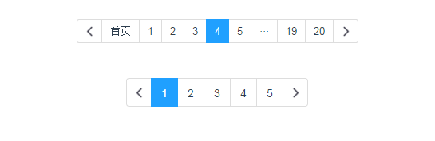

# vue-page-component 

> A pagination component for vue



Code Example

``` html
<vue-page-component 
	 :maxpage='pagination.maxpage'
	 :page='pagination.page'
	 :size='pagination.size'
	 :callback='pageCallback'>
</vue-page-component>
```

``` js
import vuePageComponent from './page.vue';
new Vue({
  el:'#app'
  data:{
    return{
      pagination:{
        page:2,
        maxpage:20,
        size:false,
      }
    }
  },
  components:{
    'vue-page-component':vuePageComponent,
  },
  methods:{
    pageCallback(page){
      this.pagination.page=page;
    }
  }	
});
```

### Options

| Props        | Type         | Example  | Description  |
| ------------- |:----------| ---------|--------------|
| page     | Number | 10 | current page |
| maxpage      | Number      |  121 | max page |
| size | Boolean     |   true | if true,view small and big otherwise |
| callback | Function   |    pageCallback | the first argument is your jump or click page|


## Build Setup

``` bash
# install dependencies
npm install

# serve with hot reload at localhost:8080
npm run dev

# build for production with minification
npm run build

# build for production and view the bundle analyzer report
npm run build --report
```

